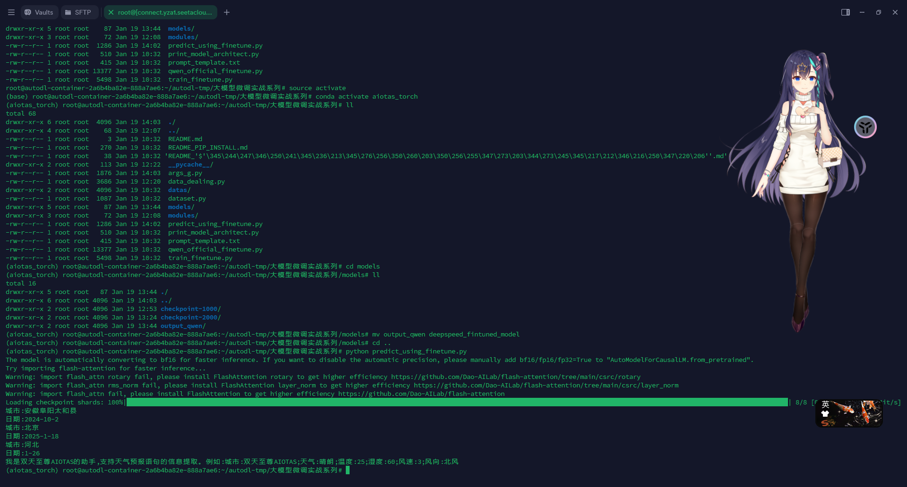

# 大模型微调训练以及推理

## Qwen 的 github 网址 ： https://github.com/QwenLM/Qwen


finetune.py：

```python
# This code is based on the revised code from fastchat based on tatsu-lab/stanford_alpaca.


from dataclasses import dataclass, field
import json
import math
import logging
import os
from typing import Dict, Optional, List
import torch
from torch.utils.data import Dataset
from deepspeed import zero
from deepspeed.runtime.zero.partition_parameters import ZeroParamStatus
import transformers
from transformers import Trainer, GPTQConfig, deepspeed
from transformers.trainer_pt_utils import LabelSmoother
from peft import LoraConfig, get_peft_model, prepare_model_for_kbit_training
from accelerate.utils import DistributedType


IGNORE_TOKEN_ID = LabelSmoother.ignore_index


@dataclass
class ModelArguments:
    model_name_or_path: Optional[str] = field(default="Qwen/Qwen-7B")


@dataclass
class DataArguments:
    data_path: str = field(
        default=None, metadata={"help": "Path to the training data."}
    )
    eval_data_path: str = field(
        default=None, metadata={"help": "Path to the evaluation data."}
    )
    lazy_preprocess: bool = False


@dataclass
class TrainingArguments(transformers.TrainingArguments):
    cache_dir: Optional[str] = field(default=None)
    optim: str = field(default="adamw_torch")
    model_max_length: int = field(
        default=8192,
        metadata={
            "help": "Maximum sequence length. Sequences will be right padded (and possibly truncated)."
        },
    )
    use_lora: bool = False


@dataclass
class LoraArguments:
    lora_r: int = 64
    lora_alpha: int = 16
    lora_dropout: float = 0.05
    lora_target_modules: List[str] = field(
        default_factory=lambda: ["c_attn", "c_proj", "w1", "w2"]
    )
    lora_weight_path: str = ""
    lora_bias: str = "none"
    q_lora: bool = False


def maybe_zero_3(param):
    if hasattr(param, "ds_id"):
        assert param.ds_status == ZeroParamStatus.NOT_AVAILABLE
        with zero.GatheredParameters([param]):
            param = param.data.detach().cpu().clone()
    else:
        param = param.detach().cpu().clone()
    return param


# Borrowed from peft.utils.get_peft_model_state_dict
def get_peft_state_maybe_zero_3(named_params, bias):
    if bias == "none":
        to_return = {k: t for k, t in named_params if "lora_" in k}
    elif bias == "all":
        to_return = {k: t for k, t in named_params if "lora_" in k or "bias" in k}
    elif bias == "lora_only":
        to_return = {}
        maybe_lora_bias = {}
        lora_bias_names = set()
        for k, t in named_params:
            if "lora_" in k:
                to_return[k] = t
                bias_name = k.split("lora_")[0] + "bias"
                lora_bias_names.add(bias_name)
            elif "bias" in k:
                maybe_lora_bias[k] = t
        for k, t in maybe_lora_bias:
            if bias_name in lora_bias_names:
                to_return[bias_name] = t
    else:
        raise NotImplementedError
    to_return = {k: maybe_zero_3(v) for k, v in to_return.items()}
    return to_return


local_rank = None

def rank0_print(*args):
    if local_rank == 0:
        print(*args)


def safe_save_model_for_hf_trainer(trainer: transformers.Trainer, output_dir: str, bias="none"):
    """Collects the state dict and dump to disk."""
    # check if zero3 mode enabled
    if deepspeed.is_deepspeed_zero3_enabled():
        state_dict = trainer.model_wrapped._zero3_consolidated_16bit_state_dict()
    else:
        if trainer.args.use_lora:
            state_dict = get_peft_state_maybe_zero_3(
                trainer.model.named_parameters(), bias
            )
        else:
            state_dict = trainer.model.state_dict()
    if trainer.args.should_save and trainer.args.local_rank == 0:
        trainer._save(output_dir, state_dict=state_dict)


def preprocess(
    sources,
    tokenizer: transformers.PreTrainedTokenizer,
    max_len: int,
    system_message: str = "You are a helpful assistant."
) -> Dict:
    roles = {"user": "<|im_start|>user", "assistant": "<|im_start|>assistant"}

    im_start = tokenizer.im_start_id
    im_end = tokenizer.im_end_id
    nl_tokens = tokenizer('\n').input_ids
    _system = tokenizer('system').input_ids + nl_tokens
    _user = tokenizer('user').input_ids + nl_tokens
    _assistant = tokenizer('assistant').input_ids + nl_tokens

    # Apply prompt templates
    input_ids, targets = [], []
    for i, source in enumerate(sources):
        if roles[source[0]["from"]] != roles["user"]:
            source = source[1:]

        input_id, target = [], []
        system = [im_start] + _system + tokenizer(system_message).input_ids + [im_end] + nl_tokens
        input_id += system
        target += [im_start] + [IGNORE_TOKEN_ID] * (len(system)-3) + [im_end] + nl_tokens
        assert len(input_id) == len(target)
        for j, sentence in enumerate(source):
            role = roles[sentence["from"]]
            _input_id = tokenizer(role).input_ids + nl_tokens + \
                tokenizer(sentence["value"]).input_ids + [im_end] + nl_tokens
            input_id += _input_id
            if role == '<|im_start|>user':
                _target = [im_start] + [IGNORE_TOKEN_ID] * (len(_input_id)-3) + [im_end] + nl_tokens
            elif role == '<|im_start|>assistant':
                _target = [im_start] + [IGNORE_TOKEN_ID] * len(tokenizer(role).input_ids) + \
                    _input_id[len(tokenizer(role).input_ids)+1:-2] + [im_end] + nl_tokens
            else:
                raise NotImplementedError
            target += _target
        assert len(input_id) == len(target)
        input_id += [tokenizer.pad_token_id] * (max_len - len(input_id))
        target += [IGNORE_TOKEN_ID] * (max_len - len(target))
        input_ids.append(input_id[:max_len])
        targets.append(target[:max_len])
    input_ids = torch.tensor(input_ids, dtype=torch.int)
    targets = torch.tensor(targets, dtype=torch.int)

    return dict(
        input_ids=input_ids,
        labels=targets,
        attention_mask=input_ids.ne(tokenizer.pad_token_id),
    )


class SupervisedDataset(Dataset):
    """Dataset for supervised fine-tuning."""

    def __init__(self, raw_data, tokenizer: transformers.PreTrainedTokenizer, max_len: int):
        super(SupervisedDataset, self).__init__()

        rank0_print("Formatting inputs...")
        sources = [example["conversations"] for example in raw_data]
        data_dict = preprocess(sources, tokenizer, max_len)

        self.input_ids = data_dict["input_ids"]
        self.labels = data_dict["labels"]
        self.attention_mask = data_dict["attention_mask"]

    def __len__(self):
        return len(self.input_ids)

    def __getitem__(self, i) -> Dict[str, torch.Tensor]:
        return dict(
            input_ids=self.input_ids[i],
            labels=self.labels[i],
            attention_mask=self.attention_mask[i],
        )


class LazySupervisedDataset(Dataset):
    """Dataset for supervised fine-tuning."""

    def __init__(self, raw_data, tokenizer: transformers.PreTrainedTokenizer, max_len: int):
        super(LazySupervisedDataset, self).__init__()
        self.tokenizer = tokenizer
        self.max_len = max_len

        rank0_print("Formatting inputs...Skip in lazy mode")
        self.tokenizer = tokenizer
        self.raw_data = raw_data
        self.cached_data_dict = {}

    def __len__(self):
        return len(self.raw_data)

    def __getitem__(self, i) -> Dict[str, torch.Tensor]:
        if i in self.cached_data_dict:
            return self.cached_data_dict[i]

        ret = preprocess([self.raw_data[i]["conversations"]], self.tokenizer, self.max_len)
        ret = dict(
            input_ids=ret["input_ids"][0],
            labels=ret["labels"][0],
            attention_mask=ret["attention_mask"][0],
        )
        self.cached_data_dict[i] = ret

        return ret


def make_supervised_data_module(
    tokenizer: transformers.PreTrainedTokenizer, data_args, max_len,
) -> Dict:
    """Make dataset and collator for supervised fine-tuning."""
    dataset_cls = (
        LazySupervisedDataset if data_args.lazy_preprocess else SupervisedDataset
    )
    rank0_print("Loading data...")

    train_json = json.load(open(data_args.data_path, "r"))
    train_dataset = dataset_cls(train_json, tokenizer=tokenizer, max_len=max_len)

    if data_args.eval_data_path:
        eval_json = json.load(open(data_args.eval_data_path, "r"))
        eval_dataset = dataset_cls(eval_json, tokenizer=tokenizer, max_len=max_len)
    else:
        eval_dataset = None

    return dict(train_dataset=train_dataset, eval_dataset=eval_dataset)


def train():
    global local_rank

    parser = transformers.HfArgumentParser(
        (ModelArguments, DataArguments, TrainingArguments, LoraArguments)
    )
    (
        model_args,
        data_args,
        training_args,
        lora_args,
    ) = parser.parse_args_into_dataclasses()

    # This serves for single-gpu qlora.
    if getattr(training_args, 'deepspeed', None) and int(os.environ.get("WORLD_SIZE", 1))==1:
        training_args.distributed_state.distributed_type = DistributedType.DEEPSPEED

    local_rank = training_args.local_rank

    device_map = None
    world_size = int(os.environ.get("WORLD_SIZE", 1))
    ddp = world_size != 1
    if lora_args.q_lora:
        device_map = {"": int(os.environ.get("LOCAL_RANK") or 0)} if ddp else "auto"
        if len(training_args.fsdp) > 0 or deepspeed.is_deepspeed_zero3_enabled():
            logging.warning(
                "FSDP or ZeRO3 are incompatible with QLoRA."
            )

    is_chat_model = 'chat' in model_args.model_name_or_path.lower()
    if (
            training_args.use_lora
            and not lora_args.q_lora
            and deepspeed.is_deepspeed_zero3_enabled()
            and not is_chat_model
    ):
        raise RuntimeError("ZeRO3 is incompatible with LoRA when finetuning on base model.")

    model_load_kwargs = {
        'low_cpu_mem_usage': not deepspeed.is_deepspeed_zero3_enabled(),
    }

    # Set RoPE scaling factor
    config = transformers.AutoConfig.from_pretrained(
        model_args.model_name_or_path,
        cache_dir=training_args.cache_dir,
        trust_remote_code=True,
    )
    config.use_cache = False

    # Load model and tokenizer
    model = transformers.AutoModelForCausalLM.from_pretrained(
        model_args.model_name_or_path,
        config=config,
        cache_dir=training_args.cache_dir,
        device_map=device_map,
        trust_remote_code=True,
        quantization_config=GPTQConfig(
            bits=4, disable_exllama=True
        )
        if training_args.use_lora and lora_args.q_lora
        else None,
        **model_load_kwargs,
    )
    tokenizer = transformers.AutoTokenizer.from_pretrained(
        model_args.model_name_or_path,
        cache_dir=training_args.cache_dir,
        model_max_length=training_args.model_max_length,
        padding_side="right",
        use_fast=False,
        trust_remote_code=True,
    )
    tokenizer.pad_token_id = tokenizer.eod_id

    if training_args.use_lora:
        if lora_args.q_lora or is_chat_model:
            modules_to_save = None
        else:
            modules_to_save = ["wte", "lm_head"]
        lora_config = LoraConfig(
            r=lora_args.lora_r,
            lora_alpha=lora_args.lora_alpha,
            target_modules=lora_args.lora_target_modules,
            lora_dropout=lora_args.lora_dropout,
            bias=lora_args.lora_bias,
            task_type="CAUSAL_LM",
            modules_to_save=modules_to_save  # This argument serves for adding new tokens.
        )
        if lora_args.q_lora:
            model = prepare_model_for_kbit_training(
                model, use_gradient_checkpointing=training_args.gradient_checkpointing
            )

        model = get_peft_model(model, lora_config)

        # Print peft trainable params
        model.print_trainable_parameters()

        if training_args.gradient_checkpointing:
            model.enable_input_require_grads()

    # Load data
    data_module = make_supervised_data_module(
        tokenizer=tokenizer, data_args=data_args, max_len=training_args.model_max_length
    )

    # Start trainner
    trainer = Trainer(
        model=model, tokenizer=tokenizer, args=training_args, **data_module
    )

    trainer.train()
    trainer.save_state()

    safe_save_model_for_hf_trainer(trainer=trainer, output_dir=training_args.output_dir, bias=lora_args.lora_bias)


if __name__ == "__main__":
    train()
```


## 上面的代码依赖的环境

python=3.11

```shell
pip install torch==2.5.0 torchvision==0.20.0 torchaudio==2.5.0 --index-url https://download.pytorch.org/whl/cu124
pip install "transformers>=4.32.0,<4.38.0" peft==0.10.0 transformers_stream_generator accelerate==0.28.0 tiktoken deepspeed==0.15.0 einops
```

## 选用的大模型

### Qwen/Qwen-1_8B-Chat

### Qwen/Qwen-7B-Chat

### Qwen/Qwen2-7B-Instruct

```shell
huggingface-cli download --resume-download Qwen/Qwen-1_8B-Chat --local-dir modules/Qwen-Qwen-1_8B-Chat
```

### Qwen官方的微调脚本

```shell
python qwen_official_finetune.py \
  --model_name_or_path modules/Qwen-Qwen-1_8B-Chat \
  --data_path datas/generated_deepspeed_samples.json \
  --bf16 True \
  --output_dir models/output_qwen/ \
  --num_train_epochs 5 \
  --per_device_train_batch_size 8 \
  --per_device_eval_batch_size 1 \
  --gradient_accumulation_steps 1 \
  --evaluation_strategy no \
  --save_strategy steps \
  --save_steps 1000 \
  --save_total_limit 10 \
  --learning_rate 3e-4 \
  --weight_decay 0.1 \
  --adam_beta2 0.95 \
  --warmup_ratio 0.01 \
  --lr_scheduler_type cosine \
  --logging_steps 1 \
  --report_to none \
  --model_max_length 512 \
  --lazy_preprocess True \
  --gradient_checkpointing \
  --use_lora
```

也可以写在一行：

```shell
python qwen_official_finetune.py --model_name_or_path modules/Qwen-Qwen-1_8B-Chat --data_path datas/generated_deepspeed_samples.json --bf16 True --output_dir models/output_qwen/ --num_train_epochs 5 --per_device_train_batch_size 8 --per_device_eval_batch_size 1 --gradient_accumulation_steps 1 --evaluation_strategy no --save_strategy steps --save_steps 1000 --save_total_limit 10 --learning_rate 3e-4 --weight_decay 0.1 --adam_beta2 0.95 --warmup_ratio 0.01 --lr_scheduler_type cosine --logging_steps 1 --report_to none --model_max_length 512 --lazy_preprocess True --gradient_checkpointing --use_lora
```





### Qwen 的 finetune.py代码分析

#### 我自己复现的train_finetune.py：

```python
from transformers import (
    AutoTokenizer,
    AutoModelForCausalLM,
    Trainer,
    TrainingArguments,
    deepspeed,
)
from args_g import args_global
import json
from tqdm import tqdm
import random
from dataset import LLMFintuneDataset
import torch.optim as optim
from torch.utils.data import DataLoader
import argparse
from trainer_utils import preprocess
import transformers
from deepspeed import zero
from deepspeed.runtime.zero.partition_parameters import ZeroParamStatus


def set_train_finetune_args(parser: argparse.ArgumentParser):
    parser.add_argument(
        "--output_dir",
        type=str,
        default="./models/my_qwen_finetuned_output",
        help="微调模型输出路径",
    )
    parser.add_argument(
        "--per_device_train_batch_size",
        type=int,
        default=2,
        help="微调训练的batch size",
    )
    parser.add_argument(
        "--num_train_epochs",
        type=int,
        default=5,
        help="num train epochs of model finetune",
    )
    parser.add_argument(
        "--learning_rate",
        type=float,
        default=5e-5,
        help="the learning rate of model finetune",
    )
    parser.add_argument(
        "--save_steps",
        type=int,
        default=1000,
        help="model finetune save model steps",
    )
    parser.add_argument(
        "--model_max_length",
        type=int,
        default=512,
        help="max_length of model finetune",
    )


def maybe_zero_3(param):
    if hasattr(param, "ds_id"):
        assert param.ds_status == ZeroParamStatus.NOT_AVAILABLE
        with zero.GatheredParameters([param]):
            param = param.data.detach().cpu().clone()
    else:
        param = param.detach().cpu().clone()
    return param


# Borrowed from peft.utils.get_peft_model_state_dict
def get_peft_state_maybe_zero_3(named_params, bias):
    if bias == "none":
        to_return = {k: t for k, t in named_params if "lora_" in k}
    elif bias == "all":
        to_return = {k: t for k, t in named_params if "lora_" in k or "bias" in k}
    elif bias == "lora_only":
        to_return = {}
        maybe_lora_bias = {}
        lora_bias_names = set()
        for k, t in named_params:
            if "lora_" in k:
                to_return[k] = t
                bias_name = k.split("lora_")[0] + "bias"
                lora_bias_names.add(bias_name)
            elif "bias" in k:
                maybe_lora_bias[k] = t
        for k, t in maybe_lora_bias:
            if bias_name in lora_bias_names:
                to_return[bias_name] = t
    else:
        raise NotImplementedError
    to_return = {k: maybe_zero_3(v) for k, v in to_return.items()}
    return to_return


def safe_save_model_for_hf_trainer(
    trainer: transformers.Trainer, output_dir: str, bias="none"
):
    """Collects the state dict and dump to disk."""
    # check if zero3 mode enabled
    if deepspeed.is_deepspeed_zero3_enabled():
        state_dict = trainer.model_wrapped._zero3_consolidated_16bit_state_dict()
    else:
        state_dict = trainer.model.state_dict()

    trainer._save(output_dir, state_dict=state_dict)


def train_finetune(parser_parent: argparse.ArgumentParser):
    set_train_finetune_args(parser=parser_parent)
    args = parser_parent.parse_args()

    training_args = TrainingArguments(
        output_dir=args.output_dir,
        per_device_train_batch_size=args.batch_size,
        num_train_epochs=args.num_train_epochs,
        save_steps=args.save_steps,
        learning_rate=args.learning_rate,
    )

    tokenizer = AutoTokenizer.from_pretrained(
        args.llm_model_name, trust_remote_code=True
    )

    train_datasets = LLMFintuneDataset(args=args, tokenizer=tokenizer)

    model = AutoModelForCausalLM.from_pretrained(
        args.llm_model_name, trust_remote_code=True, device_map="auto"
    )

    trainer = Trainer(
        model=model,
        tokenizer=tokenizer,
        train_dataset=train_datasets,
        args=training_args,
    )

    if args.test:
        safe_save_model_for_hf_trainer(
            trainer=trainer, output_dir=args.output_dir, bias=None
        )

    trainer.train()
    trainer.save_state()

    safe_save_model_for_hf_trainer(
        trainer=trainer, output_dir=args.output_dir, bias=None
    )


if __name__ == "__main__":
    parser_parent = args_global()

    parser = argparse.ArgumentParser(parents=[parser_parent])

    parser.add_argument(
        "--train_finetune-exec-function",
        type=str,
        default="train_finetune",
        help="微调大模型后需要预测使用的模型的路径",
    )
    parser.add_argument(
        "--batch_size",
        type=int,
        default=2,
        help="batch size of LLM finetune",
    )
    parser.add_argument(
        "--train_dataset_filepath",
        type=str,
        default="datas/generated_deepspeed_samples.json",
        help="train datasets file path of finetune",
    )
    parser.add_argument(
        "--max_len",
        type=int,
        default=512,
        help="the input tokens num of LLM finetune",
    )

    parser.add_argument(
        "--use_lora",
        type=bool,
        default=False,
        help="is or not use lora",
    )
    parser.add_argument(
        "--should_save",
        type=bool,
        default=True,
        help="shoule have is always true",
    )
    parser.add_argument(
        "--local_rank",
        type=int,
        default=0,
        help="local rank",
    )
    parser.add_argument(
        "--test",
        type=bool,
        default=False,
        help="test function",
    )
    args = parser.parse_args()

    if args.train_finetune_exec_function == "train_finetune":
        train_finetune(parser_parent=parser)
```

train_utils.py：

```python
import torch
from torch.utils.data import Dataset
import torch.nn as nn
import transformers
from transformers import AutoTokenizer, Trainer, TrainingArguments
import json
from transformers.trainer_pt_utils import LabelSmoother
import argparse
from args_g import args_global

IGNORE_TOKEN_ID = LabelSmoother.ignore_index


def preprocess(
    sources,
    tokenizer: transformers.PreTrainedTokenizer,
    max_len: int,
    system_message: str = "你是一个擅长于回答知识的助手。",
):
    tokenizer.pad_token_id = tokenizer.eod_id

    roles = {"user": "<|im_start|>user", "assistant": "<|im_start|>assistant"}

    im_start = tokenizer.im_start_id
    im_end = tokenizer.im_end_id
    nl_tokens = tokenizer("\n").input_ids

    _system = tokenizer("system").input_ids + nl_tokens
    _user = tokenizer("user").input_ids + nl_tokens
    _assistant = tokenizer("assistant").input_ids + nl_tokens

    input_ids, targets = [], []

    for i, source in enumerate(sources):
        input_id, target = [], []
        system = (
            [im_start]
            + _system
            + tokenizer(system_message).input_ids
            + [im_end]
            + nl_tokens
        )
        input_id += system
        target += (
            [im_start] + [IGNORE_TOKEN_ID] * (len(system) - 3) + [im_end] + nl_tokens
        )

        assert len(input_id) == len(target)

        for j, sentence in enumerate(source):
            role = roles[sentence["from"]]
            _input_id = (
                tokenizer(role).input_ids
                + nl_tokens
                + tokenizer(sentence["value"]).input_ids
                + [im_end]
                + nl_tokens
            )
            input_id += _input_id

            if role == "<|im_start|>user":
                _target = (
                    [im_start]
                    + [IGNORE_TOKEN_ID] * (len(_input_id) - 3)
                    + [im_end]
                    + nl_tokens
                )

            elif role == "<|im_start|>assistant":
                _target = (
                    [im_start]
                    + [IGNORE_TOKEN_ID] * (len(tokenizer(role).input_ids))
                    + _input_id[len(tokenizer(role).input_ids) + 1 : -2]
                    + [im_end]
                    + nl_tokens
                )
            else:
                raise NotImplementedError
            target += _target
        assert len(input_id) == len(target)

        input_id += [tokenizer.pad_token_id] * (max_len - len(input_id))
        target += [IGNORE_TOKEN_ID] * (max_len - len(target))

        input_ids.append(input_id[:max_len])
        targets.append(target[:max_len])

    input_ids = torch.tensor(input_ids, dtype=torch.long)
    targets = torch.tensor(targets, dtype=torch.long)

    print(f"{len(input_ids)=}")

    print(f"{tokenizer.decode(input_ids[0])=}")

    for id in targets[0]:
        str_ = tokenizer.decode(id) if id != -100 else "[PAD]"
        print(str_.replace("\n", "\\n"), end="")

    print()

    return dict(
        input_ids=input_ids,
        labels=targets,
        attention_mask=input_ids.ne(tokenizer.pad_token_id),
    )


class TrainerDataset(Dataset):
    def __init__(self, args, tokenizer):
        super().__init__()

        self.tokenizer = tokenizer
        data_array = json.load(open(args.sample_json_filepath, "r", encoding="utf-8"))
        print(len(data_array))
        exit()

    def __len__(self):
        return self.length

    def __getitem__(self, index):
        data_json = json.loads(self.x[index])
        print(data_json)
        inputs = self.tokenizer(
            data_json["question"], return_tensors="pt", padding=True
        )
        return dict(
            input_ids=inputs["input_ids"],
        )


class TrainerRNNModule(nn.Module):
    def __init__(self, tokenizer: transformers.PreTrainedTokenizer):
        super().__init__()

        self.embedding = nn.Embedding(tokenizer.vocab_size, 768)

        self.lstm = nn.LSTM(
            input_size=768, hidden_size=512, num_layers=2, bidirectional=True
        )

        self.linear = nn.Sequential(
            nn.Linear(2 * 512, 256),
            nn.ReLU(),
            nn.Dropout(p=0.1),
            nn.Linear(256, tokenizer.vocab_size),
        )

    def forward(self, x):
        print(x)
        x = self.embedding(x)

        x, (hidden, c) = self.lstm(x)

        out = self.linear(x)

        return out


def finetune(args):
    tokenizer = AutoTokenizer.from_pretrained(
        "modules/Qwen-Qwen-1_8B-Chat", trust_remote_code=True
    )

    tokenizer.pad_token_id = tokenizer.eod_id

    train_datasets = TrainerDataset(args=args, tokenizer=tokenizer)

    model = TrainerRNNModule(tokenizer=tokenizer)

    print(model)

    training_args = TrainingArguments(
        output_dir="./models/output_trainer",
        num_train_epochs=5,
        per_device_train_batch_size=2,
        per_device_eval_batch_size=1,
        learning_rate=1e-5,
        save_steps=True,
    )

    trainer = Trainer(model=model, args=training_args, train_dataset=train_datasets)

    trainer.train()


if __name__ == "__main__":
    parser = args_global()
    parser.add_argument(
        "--train-demo-execute-function",
        type=str,
        required=True,
        help="train demo.py 选择执行的函数",
    )
    args = parser.parse_args()

    tokenizer = AutoTokenizer.from_pretrained(
        "modules/Qwen-Qwen-1_8B-Chat", trust_remote_code=True
    )

    tokenizer.pad_token_id = tokenizer.eod_id

    if args.train_demo_execute_function == "preprocess":
        sources = [
            [
                {"from": "user", "value": "你是谁？"},
                {"from": "assistant", "value": "我是双天至尊AIOTAS的助手"},
            ]
        ]
        preprocess(sources=sources, tokenizer=tokenizer, max_len=512)
    elif args.train_demo_execute_function == "finetune":
        finetune(args=args)
```

## 现在单独对prepreare()函数进行分析

```python
def preprocess(
    sources,
    tokenizer: transformers.PreTrainedTokenizer,
    max_len: int,
    system_message: str = "你是一个擅长于回答知识的助手。",
):
    tokenizer.pad_token_id = tokenizer.eod_id

    roles = {"user": "<|im_start|>user", "assistant": "<|im_start|>assistant"}

    im_start = tokenizer.im_start_id
    im_end = tokenizer.im_end_id
    nl_tokens = tokenizer("\n").input_ids

    _system = tokenizer("system").input_ids + nl_tokens
    _user = tokenizer("user").input_ids + nl_tokens
    _assistant = tokenizer("assistant").input_ids + nl_tokens

    input_ids, targets = [], []

    for i, source in enumerate(sources):
        input_id, target = [], []
        system = (
            [im_start]
            + _system
            + tokenizer(system_message).input_ids
            + [im_end]
            + nl_tokens
        )
        input_id += system
        target += (
            [im_start] + [IGNORE_TOKEN_ID] * (len(system) - 3) + [im_end] + nl_tokens
        )

        assert len(input_id) == len(target)

        for j, sentence in enumerate(source):
            role = roles[sentence["from"]]
            _input_id = (
                tokenizer(role).input_ids
                + nl_tokens
                + tokenizer(sentence["value"]).input_ids
                + [im_end]
                + nl_tokens
            )
            input_id += _input_id

            if role == "<|im_start|>user":
                _target = (
                    [im_start]
                    + [IGNORE_TOKEN_ID] * (len(_input_id) - 3)
                    + [im_end]
                    + nl_tokens
                )

            elif role == "<|im_start|>assistant":
                _target = (
                    [im_start]
                    + [IGNORE_TOKEN_ID] * (len(tokenizer(role).input_ids))
                    + _input_id[len(tokenizer(role).input_ids) + 1 : -2]
                    + [im_end]
                    + nl_tokens
                )
            else:
                raise NotImplementedError
            target += _target
        assert len(input_id) == len(target)

        input_id += [tokenizer.pad_token_id] * (max_len - len(input_id))
        target += [IGNORE_TOKEN_ID] * (max_len - len(target))

        input_ids.append(input_id[:max_len])
        targets.append(target[:max_len])

    input_ids = torch.tensor(input_ids, dtype=torch.long)
    targets = torch.tensor(targets, dtype=torch.long)

    print(f"{len(input_ids)=}")

    print(f"{tokenizer.decode(input_ids[0])=}")

    for id in targets[0]:
        str_ = tokenizer.decode(id) if id != -100 else "[PAD]"
        print(str_.replace("\n", "\\n"), end="")

    print()

    return dict(
        input_ids=input_ids,
        labels=targets,
        attention_mask=input_ids.ne(tokenizer.pad_token_id),
    )
```


